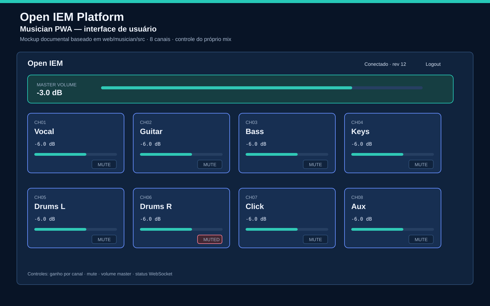
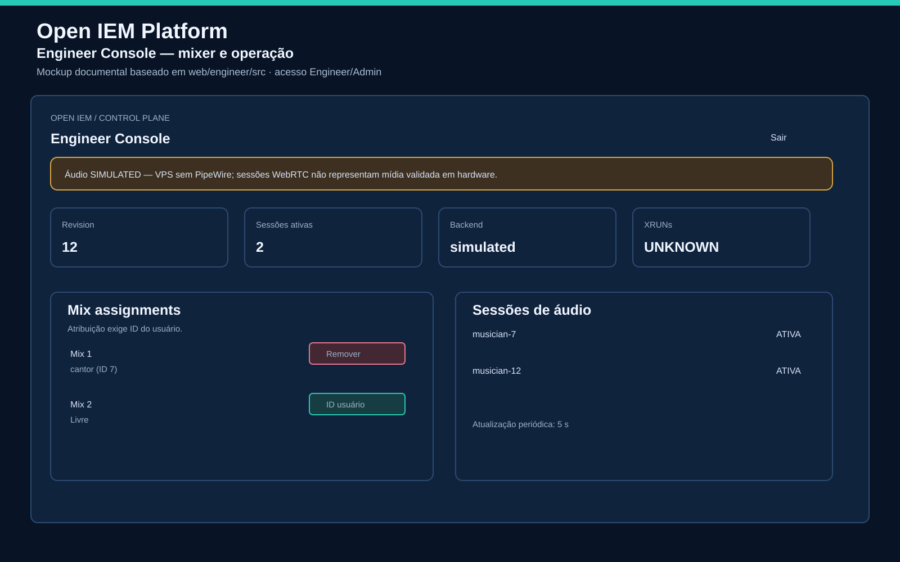

# Open IEM Platform

[](https://github.com/rickslamaral/open-iem-platform/actions/workflows/ci.yml)
[](https://github.com/rickslamaral/open-iem-platform/releases)
[](https://github.com/rickslamaral/open-iem-platform/tags)

[](https://www.rust-lang.org/)
[](https://react.dev/)
[](https://www.typescriptlang.org/)
[](LICENSE)

> **🚧 EM DESENVOLVIMENTO — Em conclusão nos próximos dias, incluindo testes finais. Não usar em produção ainda. / UNDER DEVELOPMENT — Finalizing in the coming days, including final tests. Not production-ready yet. / EN DESARROLLO — Finalizando en los próximos días, incluyendo pruebas finales. No usar en producción todavía.**

> Open-source professional personal In-Ear Monitoring platform for Linux.

## What is this?

Open IEM Platform is an open-source, Linux-native system for personal in-ear monitor (IEM) mixing in live audio environments. It allows each musician on stage to control their own independent monitor mix from a smartphone, using a Raspberry Pi or similar Linux SBC as the audio server.

## Architecture

```
Audio Sources / Interface
        |
  Linux IEM Server (PipeWire)
        |
    Mix Engine
        |
    Media Plane
        |
 WebRTC / RTP / Opus
   /              \\
Native RX       Native RX
   |                |
IEM              IEM
```

## MVP Scope

- 8 inputs
- 2 stereo mixes
- 2 músicos / 2 receivers nativos headless (um por músico); PWA somente controle
- 48 kHz / 32-bit float internal
- Gain, pan, mute, master volume, limiter
- WebSocket control
- PWA mobile interface
- Local LAN only
- Targets atuais: Windows x64, Linux x64 e Raspberry Pi 5 ARM64; suporte validado e runtime de áudio continuam condicionados a evidência. macOS, Android e iPadOS permanecem backlog

## Current Status

**Fase atual: arquitetura P0 fechada; desenvolvimento retomado pela fila em `docs/DEVELOPMENT-HANDOFF.md`.** P0-001 concluído em código; próximo item: P0-002 — Audio Lab L1/L2. Phase 92 backend WS EQ está mergeada; frontend EQ permanece backlog.

**Fases concluídas e mescladas em `main`:**

| Phase | Descrição | CI | Merge |
|---|---|---|---|
| 91 | Biquad reference validation + ARM64 cross-CI | 11/11 ✅ | ✅ |
| 90 | Browser audio constraint (ADR-005 Accepted, GAP-001/002 Resolved) | 11/11 ✅ | ✅ |
| 89 | Engineer Console channel strip (gain/mute por canal, debounce, optimistic UI) | 11/11 ✅ | ✅ |
| 88 | Musician UI master gain/mute somente leitura | 11/11 ✅ | ✅ |
| 87 | Engineer Console WebSocket master gain/mute | 11/11 ✅ | ✅ |
| 86 | Lock-free broadcast fan-out no WebSocket | 11/11 ✅ | ✅ |
| 85 | Rust code coverage (cargo-llvm-cov, LCOV, CI job) | 11/11 ✅ | ✅ |
| 84 | Reprodutibilidade de archives de release + gate de checksums duplicados | 11/11 ✅ | ✅ |
| 83 | Musician UI pan estéreo + indicador master mute | 11/11 ✅ | ✅ |

**Pendentes de validação física:** PipeWire/ALSA, WebRTC/Opus, Raspberry Pi 5, release `v0.3.1`.

## Previsão das interfaces

As imagens abaixo mostram a previsão visual atual da UI do músico e do engenheiro de mixagem. São **mockups documentais baseados no código-fonte**, não screenshots de runtime. Os valores exibidos são ilustrativos. Áudio permanece `SIMULATED` até validação em Raspberry Pi 5.

### Musician PWA



Interface prevista para músico: volume master, ganho por canal, pan, mute, estado da conexão WebSocket e controle somente do próprio mix. [Abrir imagem completa](docs/images/open-iem-musician-ui.png).

### Engineer Console



Interface prevista para engenheiro: status do backend, revisão, sessões ativas, atribuição de mixes e aviso explícito de áudio simulado. [Abrir imagem completa](docs/images/open-iem-engineer-console.png).

- [Visão geral das interfaces e controles](docs/INTERFACES.md)
- [Musician PWA](docs/images/open-iem-musician-ui.png)
- [Engineer Console](docs/images/open-iem-engineer-console.png)
- [Admin CLI/API](docs/images/open-iem-admin-cli.png) — não existe painel Admin web
- [Login](docs/images/open-iem-login.png)
- [Controles de mix](docs/images/open-iem-mix-controls.png)

## Development Phases

| Phase | Name | Status |
|-------|------|--------|
| 0 | Bootstrap & Specification Audit | ✅ Complete |
| 1 | Audio Engine POC | ✅ Complete with hardware validation pending |
| 2 | Mix Engine | ✅ Complete |
| 3 | Backend (Rust/REST/WS) | ✅ Complete |
| 4 | Musician Client | ✅ Complete |
| 5 | Audio Transport | 🔄 Signaling scaffold complete; media SIMULATED |
| 6 | Engineer UI | ✅ Operational control dashboard; media SIMULATED |
| 7 | Advanced DSP | 🔄 EQ/compressor delivered; scenes and hardware audio pending |
| 8 | Raspberry Pi Deployment | ⏳ Pending |
| 9 | Cross-Platform Builds | ⏳ Pending |
| 10 | Release Engineering | ⏳ Pending |
| 11 | Musicians Guide | ⏳ Pending |
| 12 | Future Receivers | ⏳ Conditional; requires measured technical justification |
| 27 | WebSocket State Recovery | ✅ Local implementation; CI blocked |
| 28 | WebSocket Connection Fairness | ✅ Local implementation; CI blocked |
| 29 | WebSocket Failed-Auth Limiting | ✅ Local implementation; CI blocked |
| 30 | Docker Compose development | ✅ Configuration validated; runtime pending |
| 31 | JWT post-issuance revocation | ✅ Local implementation and tests; CI blocked; unmerged |
| 32 | Deterministic audio harness | ✅ Local tests pass; CI blocked; unmerged |
| 33 | CI branch trigger diagnosis | ✅ Local correction; CI remote blocked |
| 34 | Admin CLI output correctness | ✅ Local tests pass; CI blocked; unmerged |
| 35 | Developer CLI `iem` | ✅ Local tests pass; CI blocked; unmerged |
| 38 | CLI documentation consistency | ✅ Local validation; CI blocked |
| 39 | Makefile audio harness coverage | ✅ Local validation; CI blocked |
| 40 | Compose rebuild and localhost UI binding | ✅ Local validation; CI blocked |
| 41–51 | Documentation, release and ARM64 deployment hardening | ✅ Local validation; CI blocked; hardware pending |
| 52 | Verification follow-up: redirects, CI tool pins and TLS file installation | ✅ Local validation; CI blocked |
| 53 | Release archive validation | ✅ Local validation; CI blocked |
| 54 | Release artifact provenance | 🔄 Local workflow implementation; CI blocked |
| 55 | Deployment path hardening | ✅ Local validation; CI blocked; hardware pending |
| 56 | Caddyfile temporary-directory lifetime | ✅ Local validation; CI blocked; hardware pending |
| 58 | Detached release signature verification | ✅ Local tests; workflow key management pending |
| 59 | Release archive resource limits | ✅ Local tests; CI and hardware pending |
| 61 | Fail-closed release archive input | ✅ Local tests; CI and hardware pending |
| 62 | Python security tests in CI | 🔄 Local workflow implementation; CI and hardware pending |
| 63 | Fail-closed signed-file verification | ✅ Local validation; CI and hardware pending |
| 64 | Archive validator portability error handling | ✅ Local validation; CI and hardware pending |
| 65 | Incremental archive resource validation | ✅ Local validation; CI and hardware pending |
| 66 | Canonical archive root validation | ✅ Local validation; CI and hardware pending |
| 67 | Cross-platform safe archive names | ✅ Local validation; CI and hardware pending |
| 68 | Windows archive names and signature input limits | ✅ Local validation; CI and hardware pending |
| 69 | Final release bundle validation | ✅ Local implementation; CI and hardware pending; pinned public-key fingerprint and immutable upload manifest |
| 70 | Bundle validator resource hardening | ✅ Local validation; CI and hardware pending |
| 71 | Validated release snapshot | 🔄 Local implementation; CI, release and hardware pending |
| 72 | HTTP signaling integration | ✅ Local test; CI, media and hardware pending |
| 76 | Archive payload validation | ✅ Local tests; CI, release and hardware pending |
| 77 | Structural archive validation before payload | ✅ Local tests; CI and hardware pending |
| 80 | TypeScript 7 Engineer compatibility | ✅ Merged |
| 81 | Installer and CI/release hardening | ✅ Merged |
| 83 | Musician UI pan and master mute indicator | ✅ Merged; hardware pending |
| 84 | Release reproducibility + checksum gate | ✅ Merged |
| 85 | Rust code coverage (CI job + LCOV) | ✅ Merged |
| 86 | Lock-free broadcast fan-out | ✅ Merged |
| 87 | Engineer Console WS master gain/mute | ✅ Merged |
| 88 | Musician UI master controls read-only | ✅ Merged |
| 89 | Engineer Console channel strip | ✅ Merged |
| 90 | Browser audio constraint (ADR-005) | ✅ Merged |
| 91 | Biquad validation + ARM64 cross-CI | ✅ Merged |
| 92 | WS EQ band control | ⏳ Backlog |

## Repository Structure

```
.agents/skills/       — Project-specific agent skills
.github/workflows/    — CI/CD pipelines
docs/                 — All documentation
server/               — Rust backend
web/musician/         — Musician PWA (React/TypeScript)
web/engineer/         — Engineer console (React/TypeScript)
deployment/           — RPi, systemd, Docker
experiments/          — Audio transport experiments
tests/                — Cross-cutting tests
scripts/              — Development utilities
```

## Documentation

- [Architecture Gaps](docs/ARCHITECTURE-GAPS.md)
- [Development Handoff](docs/DEVELOPMENT-HANDOFF.md)
- [Architecture Decision Records](docs/decisions/README.md)
- [Specification Audit](docs/SPEC-AUDIT.md)
- [Skills Registry](docs/SKILLS.md)
- [TODO](docs/TODO.md)
- [Development Log](docs/DEVELOPMENT-LOG.md)
- [Windows + Docker Desktop Guide](docs/guides/WINDOWS-DOCKER-GUIDE.md)
- [Guias em português](docs/guides/pt/)
- [Guides in English](docs/guides/en/)
- [Guías en español](docs/guides/es/)
- [ADR Index](docs/adr/)
- [Interface CLI](docs/CLI.md)
- [Review da Phase 33](docs/reviews/PHASE-33-REVIEW.md)
- [Review da Phase 32](docs/reviews/PHASE-32-REVIEW.md)
- [Review da Phase 31](docs/reviews/PHASE-31-REVIEW.md)

## Instalação Linux

Instalador oficial para Linux, com build local, chaves JWT geradas no host e serviço systemd:

```bash
curl -fsSL https://raw.githubusercontent.com/rickslamaral/open-iem-platform/main/scripts/install.sh -o install.sh
bash install.sh --ref <COMMIT-SHA-40-CHARS>
```

O instalador recusa branches/tags mutáveis e exige commit SHA completo. Não contém credenciais e não sobrescreve chaves JWT existentes. Para revisar antes de executar:

```bash
curl -fsSL https://raw.githubusercontent.com/rickslamaral/open-iem-platform/main/scripts/install.sh -o install.sh
less install.sh
bash install.sh --dry-run --skip-deps --ref <COMMIT-SHA-40-CHARS>
```

Veja opções com `bash install.sh --help`. Primeira instalação gera par Ed25519. Chaves existentes são preservadas; para substituir, use `bash install.sh --ref <COMMIT-SHA-40-CHARS> --rotate-keys` e confirme digitando `ROTATE`. Isso invalida todas sessões JWT. Em automação explícita: `--ref <COMMIT-SHA-40-CHARS> --rotate-keys --yes`. Áudio PipeWire/ALSA e runtime Raspberry Pi continuam pendentes de validação física.

## Contributing

See [CONTRIBUTING.md](CONTRIBUTING.md).

## Security

See [SECURITY.md](SECURITY.md).

## License

Apache 2.0 — see [LICENSE](LICENSE).
