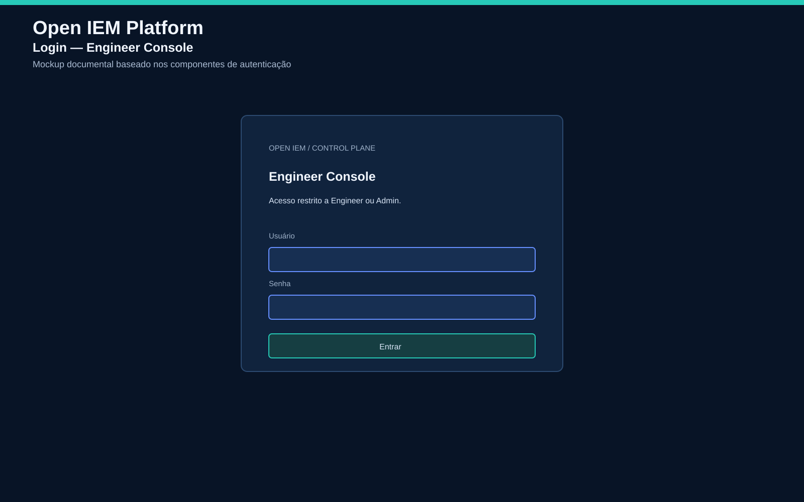
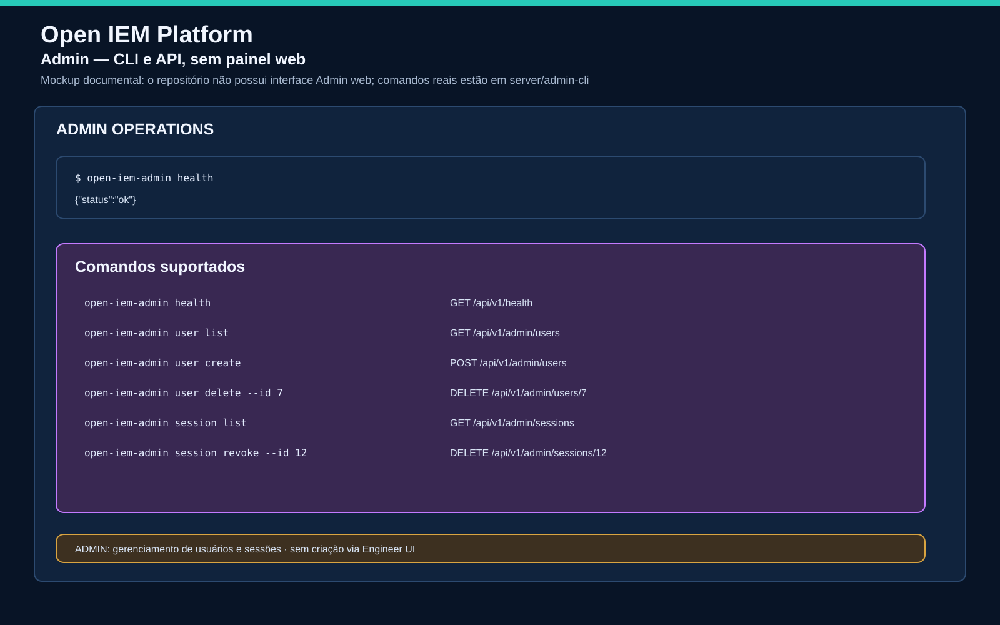
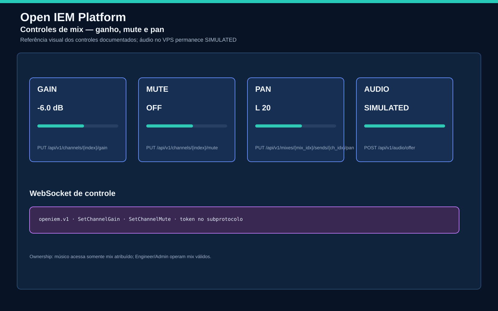
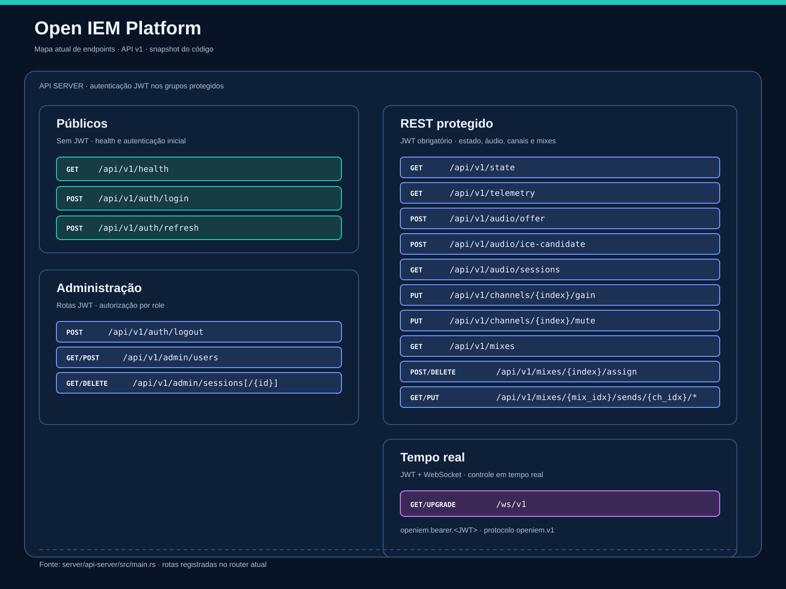

# Interfaces e controles

Imagens documentais baseadas no código-fonte atual. Não são screenshots de runtime. Containers e hardware real ainda exigem validação separada.

## Login



O Engineer Console autentica via `POST /api/v1/auth/login`. Acesso exige papel `ENGINEER` ou `ADMIN`.

## Musician PWA


Interface de músico oferece:

- oito canais: Vocal, Guitar, Bass, Keys, Drums L, Drums R, Click e Aux;
- ganho por canal entre `-60` e `+6 dB` na UI;
- mute individual;
- volume master;
- status e reconexão WebSocket;
- logout.

O músico só acessa mix atribuído. Áudio permanece `SIMULATED` no VPS.

## Engineer Console


Console operacional mostra:

- revision do estado;
- sessões de áudio ativas;
- backend e telemetria;
- XRUNs, preservando `UNKNOWN` quando métrica não está disponível;
- atribuição e remoção dos mixes;
- aviso explícito de áudio `SIMULATED`.

Engineer não cria usuários pela UI. Catálogo e gerenciamento de usuários pertencem ao Admin API/CLI.

## Admin



Não existe painel Admin web no código atual. Administração ocorre por `open-iem-admin` ou API autenticada:

```text
GET    /api/v1/admin/users
POST   /api/v1/admin/users
DELETE /api/v1/admin/users/{id}
GET    /api/v1/admin/sessions
DELETE /api/v1/admin/sessions/{id}
```

Nunca colocar senha ou token em documentação, imagem ou comando versionado.

## Controles de mix



Controles documentados:

- ganho;
- mute;
- pan por send;
- negociação de áudio via oferta SDP;
- mensagens WebSocket `SetSendGain` e `SetSendMuted` para músico, limitadas ao mix atribuído;
- mensagens `SetChannelGain` e `SetChannelMute` para Engineer/Admin, conforme autorização do control server.



## Estado de validação

- UI: implementação local presente.
- REST/WebSocket: testes locais presentes.
- Áudio real: não validado.
- PipeWire/ALSA: não validado em Raspberry Pi 5.
- WebRTC media: `SIMULATED`.
- Runtime Docker completo: depende do ambiente local.
